## Familiarize yourself with QGIS

**1.** The main area of QGIS is called the canvas. There are also panels and toolbars, a status bar and menu panels. 

**2.** Panels and toolbars may be moved around and docked at different locations (left-click and
hold to initiate this flexibility).  If you drop a panel on top of another, they will be nested into tabs. Panels you do not used can be removed. Toolbars can be moved around in much the same way, but you cannot nest toolbars into tabs. By right-clicking in the toolbar area, you may get a list of available panels and toolbars you can turn them on and off as you like.

**3.** Through the menu, you can access almost everything in QGIS; some functions have buttons, 
and keyboard shortcuts as well.

**4.** The status bar shows relevant information about the current tool or aspects of the map canvas, like coordinates and scale.

**5.** Toolbox is where you can search for all the tools provided in QGIS. If you can see the toolbox as the figure shows, you can open it in the menu (Processing->Toolbox).

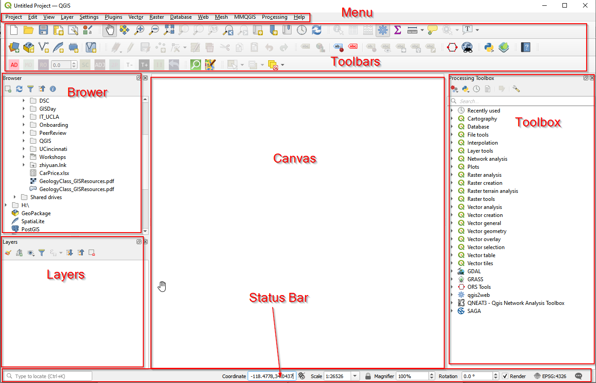

QGIS Layout
{: .text-center}

**6.** Use the map navigation toolbar to help navigate your map in the canvas. Here you can find tools to pan and zoom the map, zoom to selected features, and view the complete extent of the map or selected layer. You can also jump to a previous extent with dedicated buttons.  

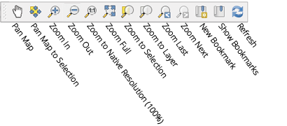

QGIS Toolbar
{: .text-center}

## Add data to QGIS

To start, we need to download the data first. There are two shapefiles: Grocery stores [Download](./data/GroceryStore_sp.zip), and Neighborhood boundary [Download](./data/Neighborhood_sp.zip), and a csv file: Apartments [Download](./data/Apartments.csv).

### Add vector data 

**1.**  Left-click the "Layer" menu option, hover over "Add Layer," and left-click the "Add Vector Layer" option. 

Add a vector layer
{: .text-center}

**2.**  In Data Source Manager window, click the button and navigate to the folder where the data is. Once select GroceryStores_sp.shp, click Add. 

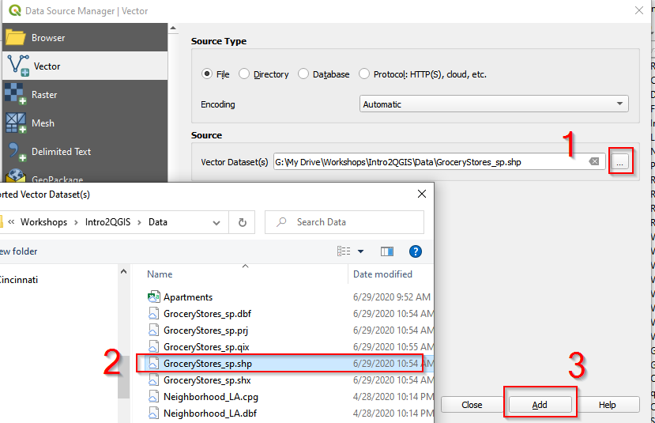

Add Grocery store layer
{: .text-center}

**3.**  Follow the same procedure and Add Neighborhood_sp.shp.

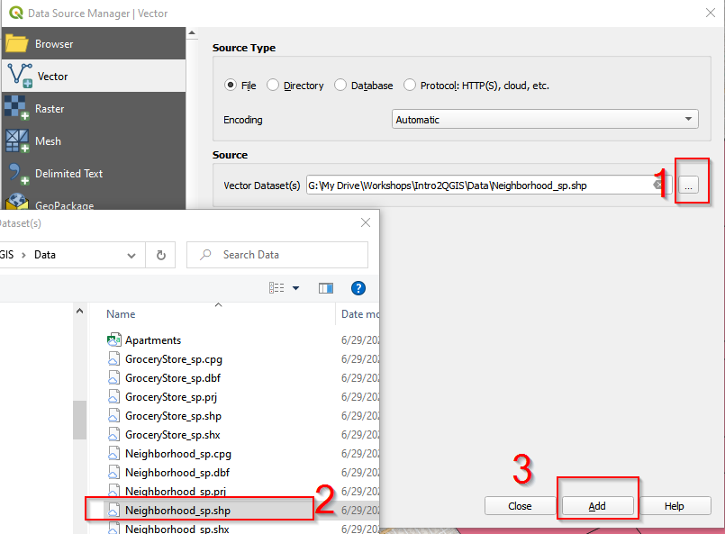

Add Neighborhood layer
{: .text-center}

**4.**  After adding GroceryStores_sp.shp and Neighborhood_sp.shp, close the Data Source Manager window.

### Add delimited file

QGIS can convert X Y Coordinates into locations on a map. Open Apartments.csv and you can see X_Coor and Y_Coor columns. These are geospatial information for these apartments. We can map X_Coor and Y_Coor as a point layer in QGIS.

**1.**  In the menu bar, click Layer, then Add layer, and choose Add Delimited Text Layer.

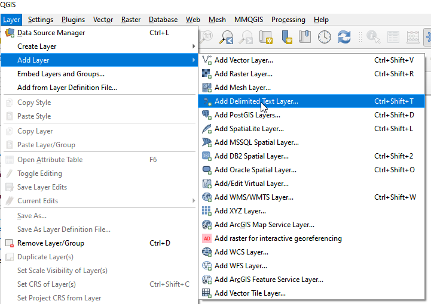

Add delimited file
{: .text-center}

**2.**  In the Data Source Manager window
        (1) navigate to the Data folder
        (2) choose Apartment.csv. 
        (3) Make sure Geometry CRS is EPSG: 4326 - WGS84. 
        (4) Click Add. 
        Close the Data Source Managerwindow. Apartments should show in the Canvas. 

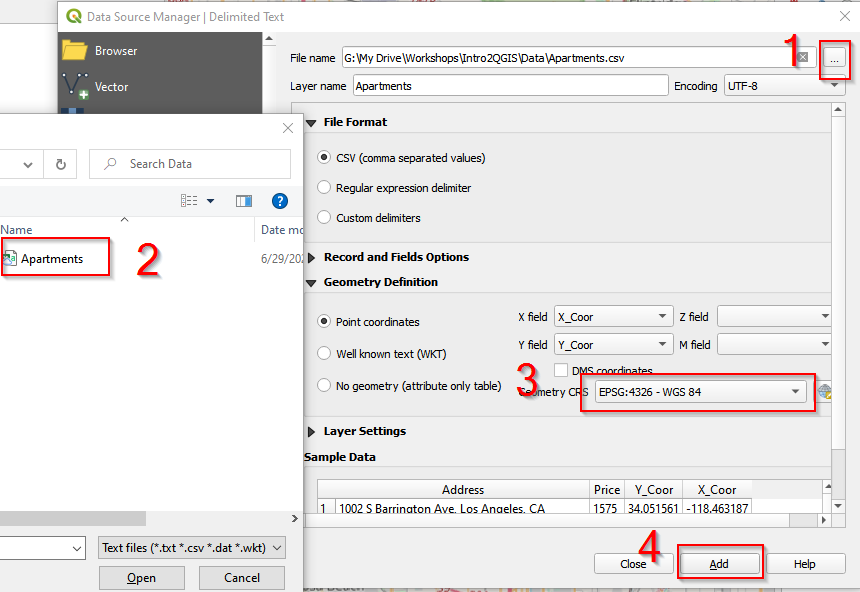

Add Apartments layer
{: .text-center}

**3.**  The Canvas looks like the following. There are two points layers (Apartments, and GroceryStore_sp), and one polygon layer (Neighborhood_sp).

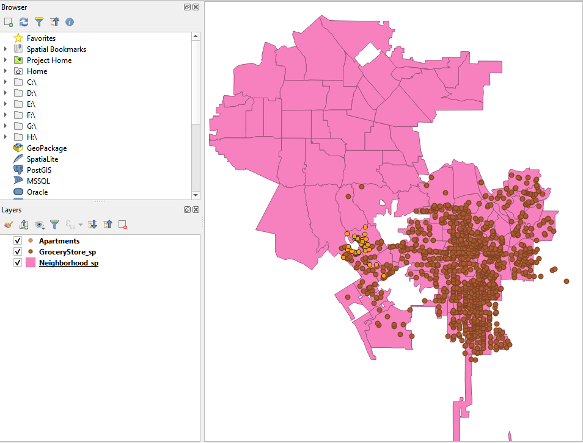

Layout after adding layers
{: .text-center}

## Add a basemap

QGIS provides access to a variety of online base maps. You can add these base maps by building [XYZ Tiles connections](https://www.spatialbias.com/2018/02/qgis-3.0-xyz-tile-layers/). Here we add Google Road/Streets as the base map for the project. 

**1.**  Find XYZ Tiles in Brower. Right click XYZ Tiles. 

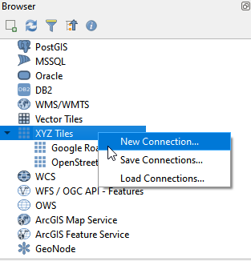

Add a new connection of XYZ Tile
{: .text-center}

**2.**  In the XYZ Connection window, name the new XYZ Tile as Google Road/Streets, and copy  https://mt1.google.com/vt/lyrs=m&x={x}&y={y}&z={z} into URL. Click OK. 

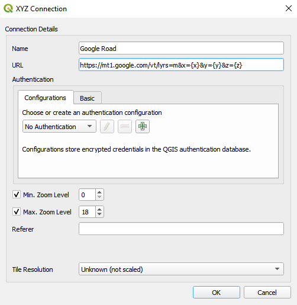

Add Google Streets as the basemap
{: .text-center}

**3.**  Drag Google Road into the Canvas and move Google Road layer to the bottom in Layers Panel. 

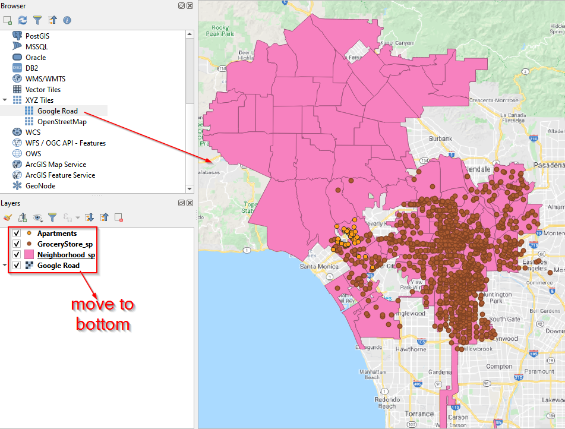

Drag Google Streets to the Canvas
{: .text-center}

## Add a plugin 

As an open source software, QGIS have an active community constantly contributing to a variety of tools by developing QGIS plugins. We will use a MMQGIS plugin in this project. 

**1.**  To add a plugin, go to Menu, and click Plugins. Then click Manage and Install Plugins.

Manage and install plugins
{: .text-center}

**2.**  In the Plugins window, search for **MMQGIS**. Click the mmqgis and then Install Plugin. 

MMQGIS plugin
{: .text-center}

**3.**  After installation, check the box in front of **mmqgis**. 

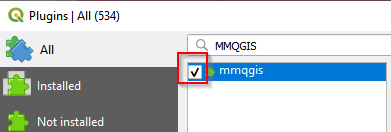

Check mmqgis plugin
{: .text-center}

**4.**  With successful installation, you should see the MMQGIS in the Menu bar. 

Check mmqgis plugin
{: .text-center}



