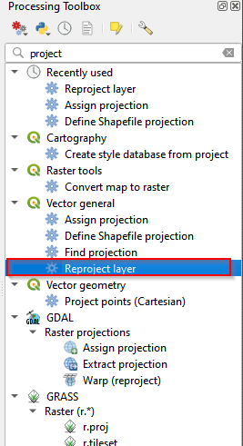
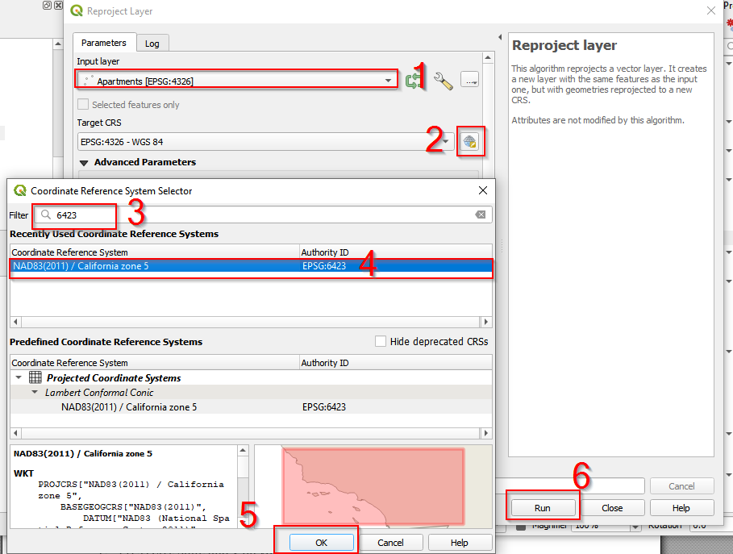
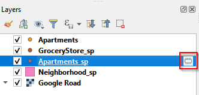
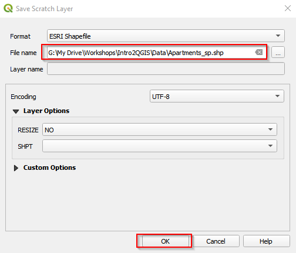
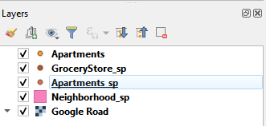
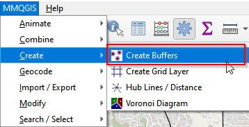
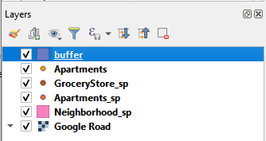
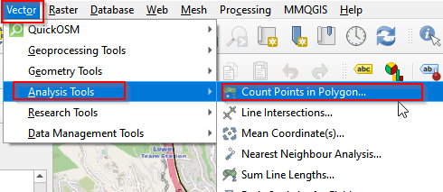
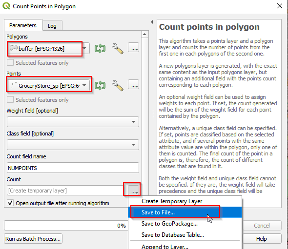
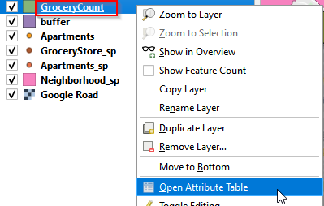

## Projection 

Before we do the spatial analysis to find the suitable apartments, we need to **project** the ***Aparments*** layer. The Apartment layer is converted from a csv and the locations are derived from X and Y coordinates. X and Y coordinates are longtitudes and latitudes which represent locations on a global. We need to project the locations onto a "a flat piece of paper" before we do the analysis.

Projecting a map into different projections means drawing the earth surface onto a "a flat piece of paper". There are a variety of methods to "draw", among which there are three major methods: planar (left), conic (middle), and cylindrical (right) projections. 

Different Projections [Source](https://www.google.com/url?sa=i&url=https%3A%2F%2Fgistbok.ucgis.org%2Fbok-topics%2Fmap-projections&psig=AOvVaw2Cyb9hT3V7QTPVg7j3ttVL&ust=1593707844112000&source=images&cd=vfe&ved=0CAIQjRxqFwoTCOials--rOoCFQAAAAAdAAAAABAW)
{: .text-center}

The Apartments layer we mapped into QGIS canvas are locations represented by X and Y Coordinates (latitude and longitude on the Earth surface). To analyze the layer, we need to project the Apartments layer from latitude and longitude (unit in degrees) to a "flat paper" using a suitable method. We will project the Apartments layer into **NAD83(2011)/California Zone 5**. 

**1.**   Go to Processing Toolbox and search for projection. If the Processing Toolbox does not show on the right panel of QGIS layout. Go to the Menu, Processing, and Click Toolbox. 

**2.**   Select Reproject Layer. 

Reproject layer 
{: .text-center}

**3.** In the Reproject Layer
* (1) choose **Apartmets**
* (2) click the button to select projections
* (3) type in **6432** in the Filter
* (4) choose **NAD83(2011)/California zone 5**
* (5) Click OK 
* (6) After the configuration, Cilck run. 

Find NAD83(2011)/California zone 5 projection
{: .text-center}

**4.**  Once the projection is done, you can find there is a new layer named Reprojected showing up in the Layer panel. 

Rename teh reprojected layer
{: .text-center}

**5.**  Rename the Reprojected layer as Apartment_sp. Sp means State Plane, which is the projection system specifically for United States. NAD83(2011)/California zone 5 is a part of State Plane Projection. 

Rename the layer
{: .text-center}

## Save the reprojected layer

**1.** Looking at the renamed layer: Apartments_sp, you can find there is a button (looks like a caterpillar). This button indicates the layer is a temporal layer and is not saved. To save this layer, click the "caterpillar" button, a Save Scratch Layer window pops up. 

Save the scratch layer (a)
{: .text-center}

**2.** Name the file as Apartments_sp and save it in your working folder. Click OK. 

Save the scratch layer (b)
{: .text-center}

**3.** After saving the layer, go back and check the Apartments_sp in the Layer panel. The "caterpillar" button disappears, indicating the layer is saved. 

Save the scratch layer (c)
{: .text-center}

## Spatial Analysis 

To find out which places are suitable for the student, we set two criteria:

* **there are at least 2 grocery stores within 400 meters of the buffer centered at the Apartments.**
* **Price is less than $1300. According to a study, a distance of 0.25 miles is often used as an accepted in U.S. research studies. We set 400 meters as the walking distance to make buffers around apartments.**

The price is set arbitrarily. You can set different price thresholds to compare the different result.

To meet the criteria, we need to

[`a. make 400 meters distance buffers centered at apartment`](##Creat walking distance buffers)

[`b. count the number of grocery stores with the buffers`](##Count points within buffers)

[`c. join the buffer's attribute to apartments layer`](#Join attribute layer)

[`d. select the targeted apartments by attributes`](#Select feature class by attributes)

[`e. export the targeted apartents`](#Export the selected feature class)

[`f. invert selection/select the rest of apartments, and export the unselected`](#Invert selection)

[`g. deselect all`](#Deselect the selected feature class)

## Create walking distance buffers

**1.**  Go to Menu bar and find MMQGIS (the plugin installed). Click Create Buffers.

Create buffers 
{: .text-center}

**2.**  In the Create Buffers window 
* (1) select Apartments_sp. This is the layer that we will center to create buffers.
* (2) Set the radius as 400
* (3) Unit is meters
* (4) Click the button to save the buffers.
* (5) Save as buffer.shp
* (6) Click OK. 

Create buffers around Apartments layer 
{: .text-center}

**3.**  The buffer layer should show up in the Layer panel. 

Buffer in the layer panel
{: .text-center}

## Count points within buffers

**1.**  In the Menu bar, find Vector. Go to Analysis tool and Click Count Points in Polygon. 

Count points in polygon (a)
{: .text-center}

**2.**  Select buffer for Polygons, GroceryStore_sp for Points. Then go to Count and Click Save to File. 

Count points in polygon (b)
{: .text-center}

**3.**  Navigate to the Save the output as GroceryCount.shp. The saved file should show up in the Layer Panel.

Save the GroceryCount layer
{: .text-center}

## Join attribute layer

We counted the number of grocery stories with each buffer, and the information is stored in GroceryCount Layer. Let's check the attribute table, find the information (NUMPOINTS) and join the attribute table to Apartments_sp. 

**1.**  Right-click GroceryCount and Open Attribute Table. 

Open attribute layer
{: .text-center}

**2.**  There are 5 attributes (columns) in the table, and the last one is NUMPOINTS. This is the number of grocery stores in each 400 meters buffer. 

Attribute table of Grocery Count layer
{: .text-center}

**3.**  To join GroceryCount's attribute table to Apartments_sp, we need to 
* (1) open Apartments_sp attribute table
* (2) find the shared column, and join. 
Right click Apartments_sp and Open Attribute Table. 

Open attribute table
{: .text-center}

**4.**  Comparing the two attributes tables, both GroceryCount and Apartments_sp have Address column. We will use Address as the shared column to join these two tables.  

Attribute tbale of Apartments_sp layer
{: .text-center}

**5.**  Go to Processing Toolbox, and type in Join in the search bar. Select Join attributes by field value. 

Join in processing Toolbox
{: .text-center}

**6.**  In the Join Attributes by Field Value window, choose Apartments_sp as the Input Layer and Address as Table field. Choose GroceryCount as Input Layer 2 and Address as Table field 2. Click Run. 

Join tables by field value
{: .text-center}

**7.**  A Joined Layer shows up in the Layer Panel. Right-Click it and rename the layer as Apartment_GroceryCount. 

Rename Joined Layer
{: .text-center}

**8.**  here is a "caterpillar" button, indicating this is a scratch layer that is not saved on local drive. To save it, click the "caterpillar" button and save it as Apartment_GroceryCount.shp. 

Save Apartments_GroceryCount
{: .text-center}

## Select feature class by attributes

To select by attributes, we need to open attribute table and look at how many attributes the table has and which attribute we will analyze.

**1.**  Right click Apartments_GroceryCount and Open Attribute Table. 

Open attribute table of Apartments_GroceryCount
{: .text-center}

**2.**  There are total 443 records with 11 columns (attributes). Click the Select feature using an expression. 

Select by expression (a)
{: .text-center}

**3.**  Go to Expression tab.  There are three panels in the window, expression (left), a list of functions (middle), and explanation of functions (right). Choose functions from the middle panel. 

**4.**  Click the functions from Fields and Values and Operates in the middle panel and make the expressions: "NUMPOINTS" >= AND "Price" <= 1300. Then click Selected Features. 

Select by expression (b)
{: .text-center}

**5.**  You can see the selected features are highlighted in the Canvas. There are 2 apartments selected.

## Export the selected feature class

**1.**  Right click the Apartments_GroceryCount. Choose Export and click Save Selected Features As.

**2.**  Save the selected features as Apartment_Selected.shp. Click OK.

Save selected features (b)
{: .text-center}

## Invert selection

Saving the selected apartments, we Invert selections and export the apartments that are not selected. We need the unselected apartments for mapping later. 

**1.**  In the attribute table, click the Invert selection button. The selection changes into the rest of the unselected apartments. 

Invert selection
{: .text-center}

**2.**  Export the new selection as Apartment_NotSelected.shp. 

 
Save selected features (c)
{: .text-center}

Save selected features (d)
{: .text-center}

## Deselect the selected feature class

After exporting Apartment_Selected and Apartment_NotSelected, go to the Tool bar in QGIS and Click Delected Features from the Current Active Layer. This will deselect the selected features in Apartement_GroceryCount layer. 

Deselect features from the current active layers
{: .text-center}


